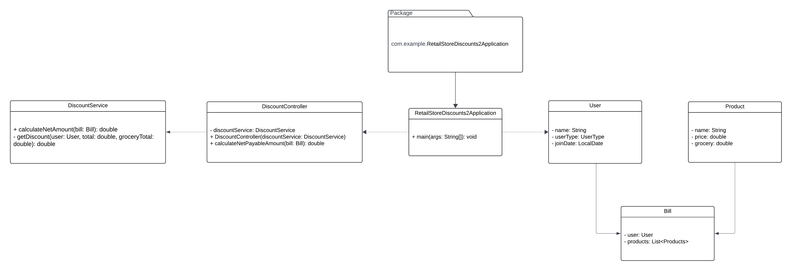

# Retail Store Discounts

This project calculates discounts for a retail store based on user type and purchase history.

## Table of Contents
- [Installation](#installation)
- [Running the Application](#running-the-application)
- [Running Tests](#running-tests)
- [UML Class Diagram](#uml-class-diagram)
- [Project Structure](#project-structure)

## Installation

1. **Clone the repository:**
```
https://github.com/NeelAiv/RetailStoreDiscounts2.git
```

## Running the Application

1. **Running statically**

- To run this project statically, go to RetailStoreDiscounts2Application.java and run it.
- By default, this project will run on port 8080. We can change the port by simply adding
``server.port=port number``
in the application.properties file which is present in ``src/main/resources``
- To check the output you can go to postman and hit POST request, and you should pass this url ``localhost:8080/api/calculate``. Change the port number with the port number you have chosen.
- In the body select raw and you should pass body like this
```
  {
  "user": {
    "name": "Jane Doe",
    "userType": "customer",
    "joinDate": "2020-05-10"
  },
  "products": [
    {
      "name": "Washing Machine",
      "price": 800,
      "grocery": false
    },
    {
      "name": "Dishwasher",
      "price": 600,
      "grocery": false
    },
    {
      "name": "Bananas",
      "price": 30,
      "grocery": true
    }
  ]
}
  ```
- Now hit the send button and you should get output like this ``1290.0``
- You can also check your console of the IDE. You will see output like this printed in the console
````Total: 1430.0
  Grocery Total: 30.0
  Discount: 70.0
  Added Discount: 70.0
  Net Amount: 1290.0
````

2. **Running from command line**

- Open your command prompt and direct to the parent directory of the main java file
- Here I have used maven to build project. To build project using maven, enter the following command into your command prompt
`mvn clean install``
- To run the application enter this command
``mvn spring-boot:run``
- The API is running at ``http://localhost:8080/api``
- Open Postman and hit the POST request with this url
``http://localhost:8080/api/calculate``
- In the body select raw, and you should pass body like this
```
{
  "user": {
    "name": "Jane Doe",
    "userType": "customer",
    "joinDate": "2020-05-10"
  },
  "products": [
    {
      "name": "Washing Machine",
      "price": 800,
      "grocery": false
    },
    {
      "name": "Dishwasher",
      "price": 600,
      "grocery": false
    },
    {
      "name": "Bananas",
      "price": 30,
      "grocery": true
    }
  ]
}
  ```
- Now hit the send button and you should get output like this ``1290.0``. This output denotes net payable amount.

3. **Running from jar file**

- Run ``mvn clean install`` command in your command prompt.
- In the parent directory, target folder will be created, and you can see a jar file like ````RetailStoreDiscounts2-0.0.1-SNAPSHOT.jar````
- Open the target folder directory and run the jar file with this command ``java -jar RetailStoreDiscounts2-0.0.1-SNAPSHOT.jar`` 
- Now you can send same requests through Postman

## Running Tests

- To run the test you should enter this command into your command prompt
``mvn test``

## UML Class Diagram

This is the UML diagram which shows the relationship of classes present in the project



## Project Structure
```
RetailStoreDiscounts2/
├── src/
│   ├── main/
│   │   ├── java/
│   │   │   └── com/example/RetailStoreDiscounts2/
│   │   │       ├── Bill.java
│   │   │       ├── Product.java
│   │   │       ├── User.java
│   │   │       ├── controller/
│   │   │       │   └── DiscountController.java
│   │   │       └── service/
│   │   │           └── DiscountService.java
│   │   └── resources/
│   │       └── application.properties
│   └── test/
│       └── java/
│           └── com/example/RetailStoreDiscounts2/
│               └── RetailStoreDiscounts2ApplicationTests.java
└── pom.xml
```